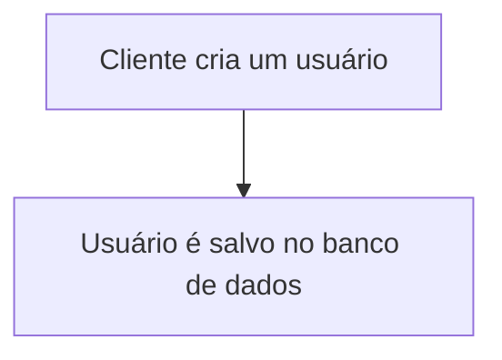
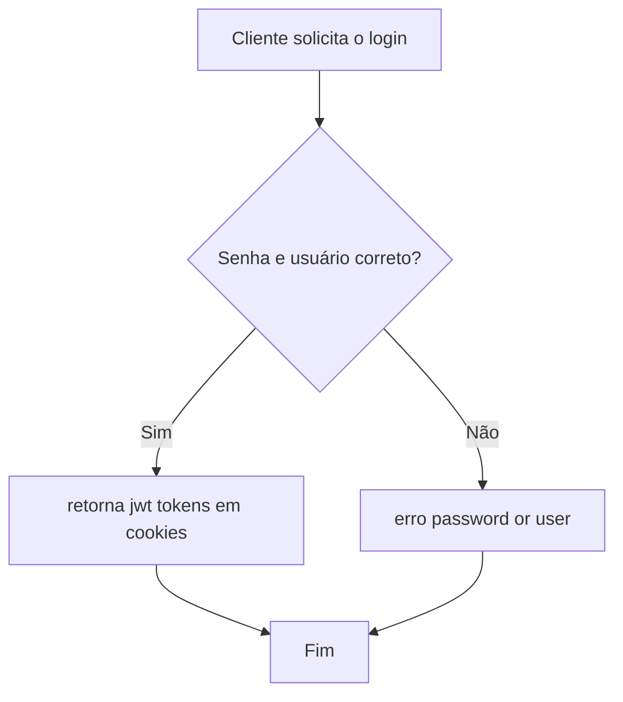
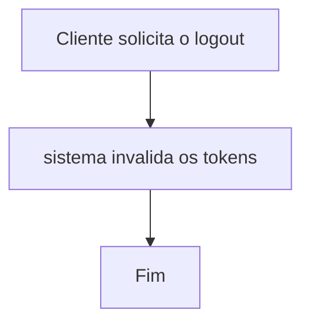
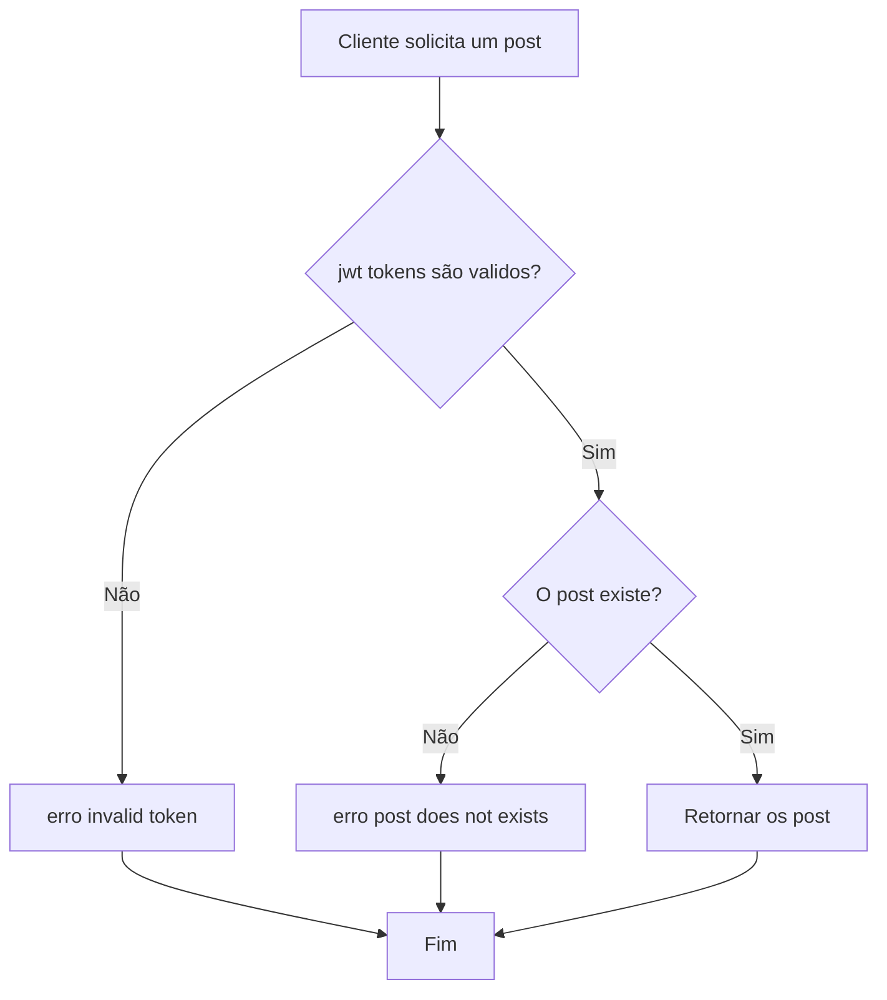
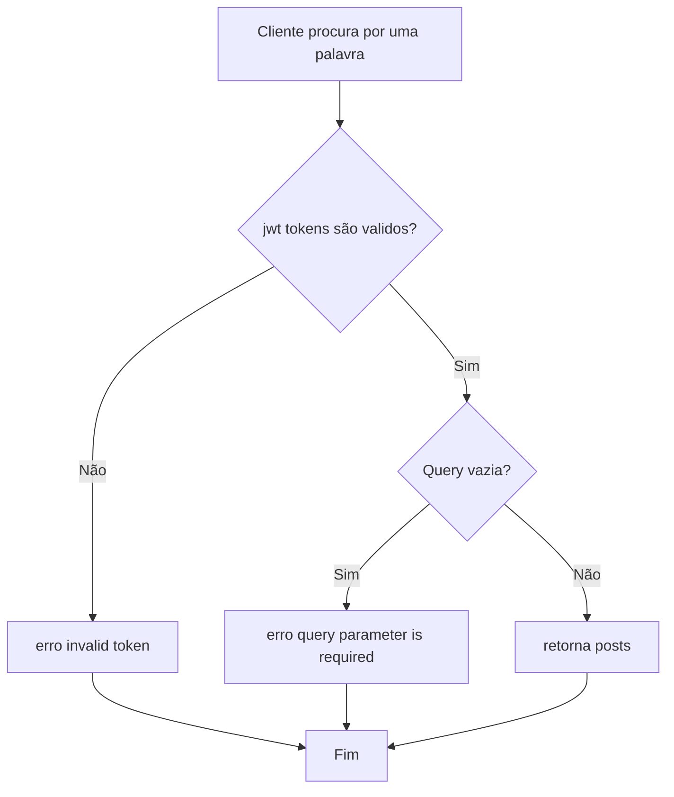
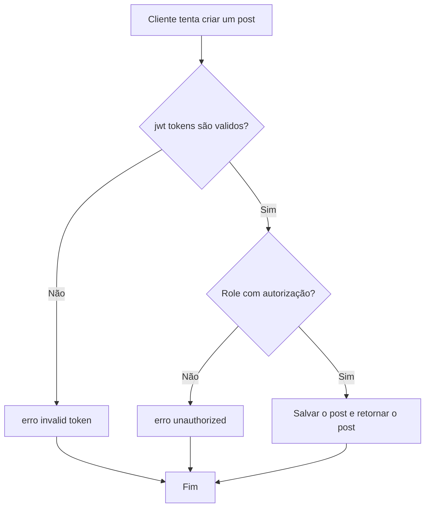
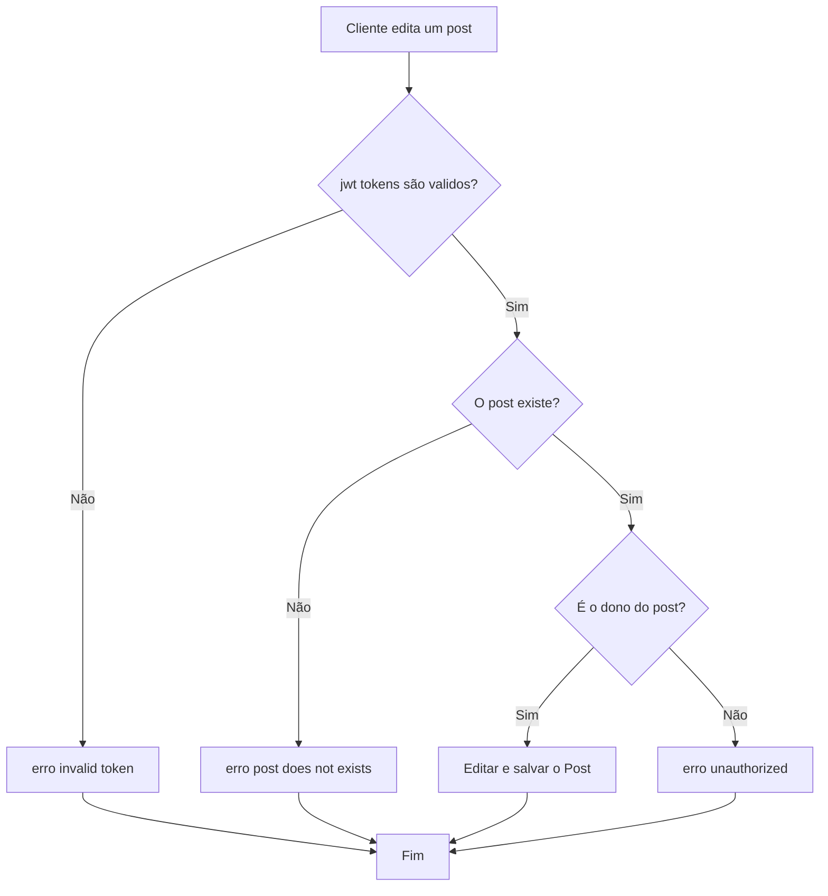
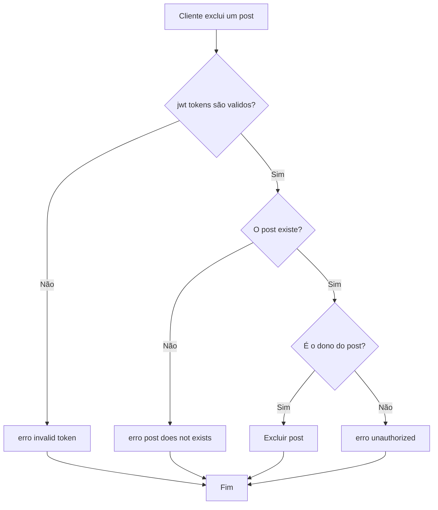

 # Back-end sistemas de Posts


# Índice 
* [Descrição do Projeto](#descrição-do-projeto)
* [Status do Projeto](#status-do-projeto)
* [Funcionalidades](#funcionalidades)
* [Tecnologias utilizadas](#tecnologias-utilizadas)
* [Pessoas Contribuidoras](#pessoas-contribuidoras)
* [Pessoas Desenvolvedoras do Projeto](#pessoas-desenvolvedoras)
* [Conclusão](#conclusão)

# Descrição do projeto

Este é um Back end completo para um sistema de gerenciamento de posts proposto como resolução do Tech Challenge 2 da FIAP,
esse back-end será usado para dar  vida a versão escalável do sistema feito no Tech Challenge 1 onde foi usado o OutSystems
para fazer o sistema original. Este projeto possui os arquivos necessários para subir uma API e um banco de dados.

# Status do Projeto

Este projeto já cumpre com os requisitos proposto pelo Tech Challenge tornando-o assim completo para a entrega

# Pré-requisitos

* Node.js(V22)
* Docker desktop
* Docker Compose

## Definir env

* Primeiro passo é definir a porta onde a API irrá escutar as requisições
```
PORT = 3000
```

* Agora prepare o link de conexão com o mongoDB
```
MONGO_URI = mongodb://mongo:27017/postDB
```

* Defina as variáveis secrets
```
ACCESS_TOKEN_SECRET=...
REFRESH_TOKEN_SECRET=...
```

## Subir a aplicação

* Para subir a aplicação será necesspario ter o docker na sua máquina
* Após a instalação do docker e iniciar os processos do mesmo digite o comando abaixo no mesmo local do projeto

```
docker-compose up --build
```


# Funcionalidades

## Gerenciamento básico de usuários

Para deixar os testes da aplicação mais simples e avaliação foi criado rotas de gerenciamento básicos de usuários
sendo eles o registro de usuários, login e autenticação de usuários e o logout de usuários.
Essa funcionalidade não foi pedida no Tech Challenge porém foi decidido que seria interessante ter a mesma para testes de bloqueio de autorização da aplicação,
mais no futuro o certo seria criar uma outra aplicação mais completa e robusta apenas para o gerenciamento de usuários para separar as regras do negócio.

- `POST /users/register`: Endpoint para registrar um usuário
  
```
{
    "user_name": "nome do usuário",
    "user_email": "email do usuário",
    "user_pass": "senha do usuário",
    "role": "role do usuário podendo ser read ou readWrite",
}
```




- `POST /users/login`: Endpoint para logar com os dados de um usuário
  
```
{
    "user_email": "email do usuário",
    "user_pass": "senha do usuário",
}
```



- `GET /users/logout`: Endpoint para logout de um usuário



## Gerenciamento de Posts

Esse é o ponto principal da aplicação, a aplicação possui controles para criar, visualizar um ou mais posts, procurar por posts que possuem certas palavras, editar posts e deletar posts.
As rotas de criação, edição e exclusão de posts são protegidas por autenticação onde apenas usuários logados com permissão readWrite podem fazer criar, excluir e a rota de editar, que também é protegida
para evitar que outras pessoas sem ser o criador do post o edite.
As rotas de visualização e procura de posts são protegidas de forma que apenas usuários logados possuem autorização para acessar.

- `GET /posts`: Endpoint para retornar todos os posts

 ```mermaid
flowchart TD
    A[Cliente solicita a lista de posts] --> B{jwt tokens são validos?}
    B -->|Sim| C[retorna o post]
    B -->|Não| D[erro invalid token]
    C --> E[Fim]
    D --> E
```

- `GET /posts/:id`: Endpoint para retornar detalhes do post fornecendo o id do post

```
retorna:
{
    user_name: { type: "String" },
    user_id: { type: "String" },
    post_title: { type: "String" },
    post_description: { type: "String" },
    post_creation_date: { type: "Date" },
    post_last_modify_date: { type: "Date" },
    post_video_url: { type: "String" }

  }
```



- `GET /posts/search`: Endpoint para procurar por posts que possuem certas palavras


  
- `POST /posts`: Endpoint para criar posts
```
{
    "user_name": "nome do usuário",
    "post_title": "título do post",
    "post_description": "descrição do post",
    "post_videp_url": "link para um vídeo",
}
```




- `PUT /posts/:id`: Endpoint para editar posts
```
{
    "user_name": "nome do usuário",
    "post_title": "título do post",
    "post_description": "descrição do post",
    "post_videp_url": "link para um vídeo",
}
```



- `DELETE /posts/:id`: Endpoint para exclusão de postagens
  



# Desafios

A maior dificuldade durante a criação do app foi a montagem dos controles da API, não foi uma dificuldade impeditiva, porém foi necessário muitas horas gastas em leitura de documentação, debug, e aulas complementares para entender a estruturação, melhores práticas de código e encriptamento de dados. Um ponto de falha como programador foi que durante todo o tempo de pesquisa e implementação houve vezes em que foi perdido o objetivo do programa ou variáveis eram passadas de forma errada por não ter separado um desenho das variáveis dentro banco de dados.

Houve dificuldades também durante a montagem do container utilizando o docker-compose, visto que pequenos detalhes de comandos poderiam resultar em erros como a falta do "." em um dos comandos, oque gerou horas desnecessárias de debug em códigos que já estavam corretos.

Outro problema foram os testes, como eu tenho pouco tempo para realizar as aulas e fazer o projeto decidi optar por fazer o projeto enquanto via as aulas, assim as aulas de TDD ficaram mais para o meio/final do projeto, isso dificultou a ideia do código ser criado juntamente dos testes, também foi necessário muito estudo nessa parte visto que o Jest de apresentou como uma ferramenta nova na minha caixa de ferramentas, isso demandou mais leitura de documentações e video aulas. Muitas vezes também a função funcionaria em situações reais mas não passaria no teste por falta de conhecimento minha de como realizar o mesmo.

Dificuldade *pessoal* de interpretação, como eu venho de outra área onde tudo deve ser detalhado nos mínimos detalhes, ter a falta de instruções muito específicas deixaram-me confuso, isto aconteceu nas rotas GET /posts onde a rota é citada duas vezes durante o TechChalenge. Assim não sei se o endpoint possui duas funções ou uma, visto que para o sistema desenvolvido todo post criado é um post publicado já que não foi reqwuisitado que deveriam ter posts que não seriam publicados mas que seriam criados.

Autor do projeto


