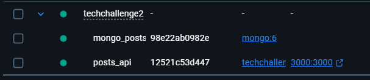
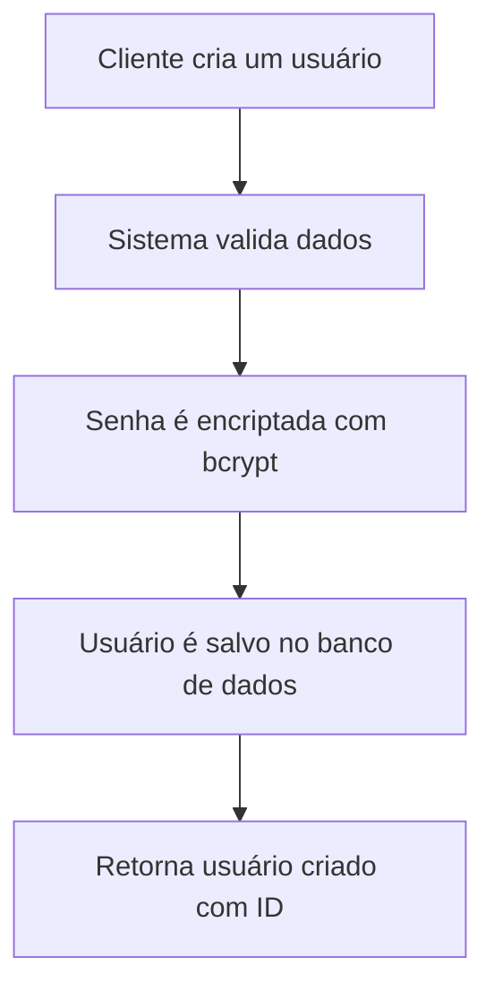
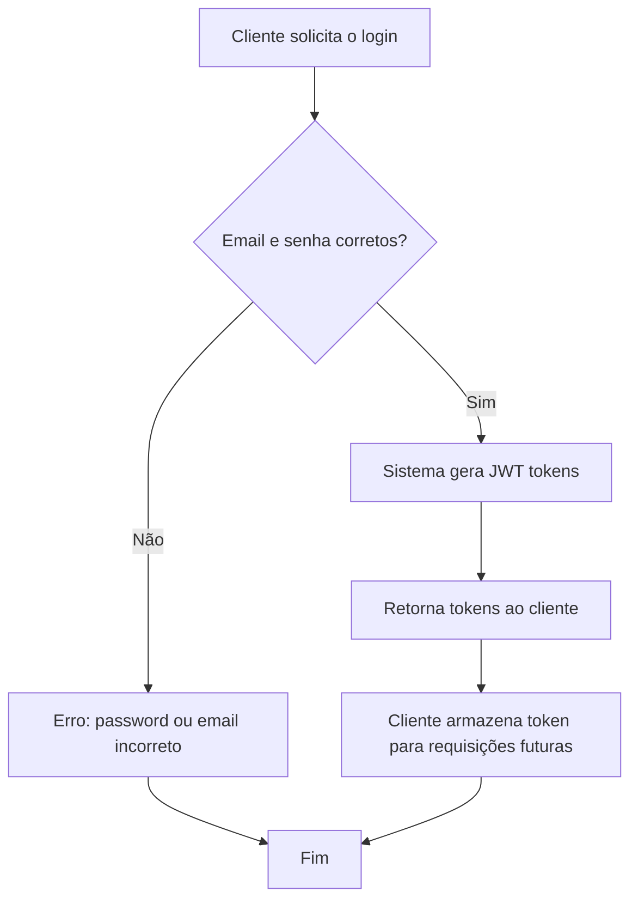
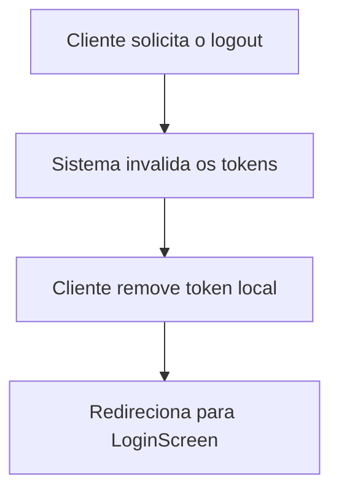
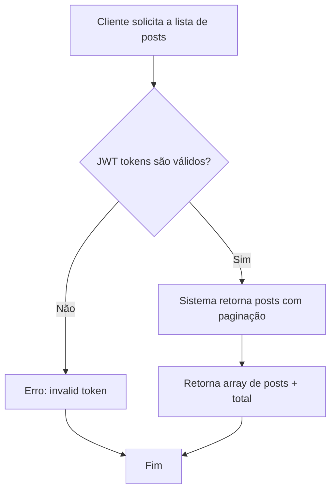
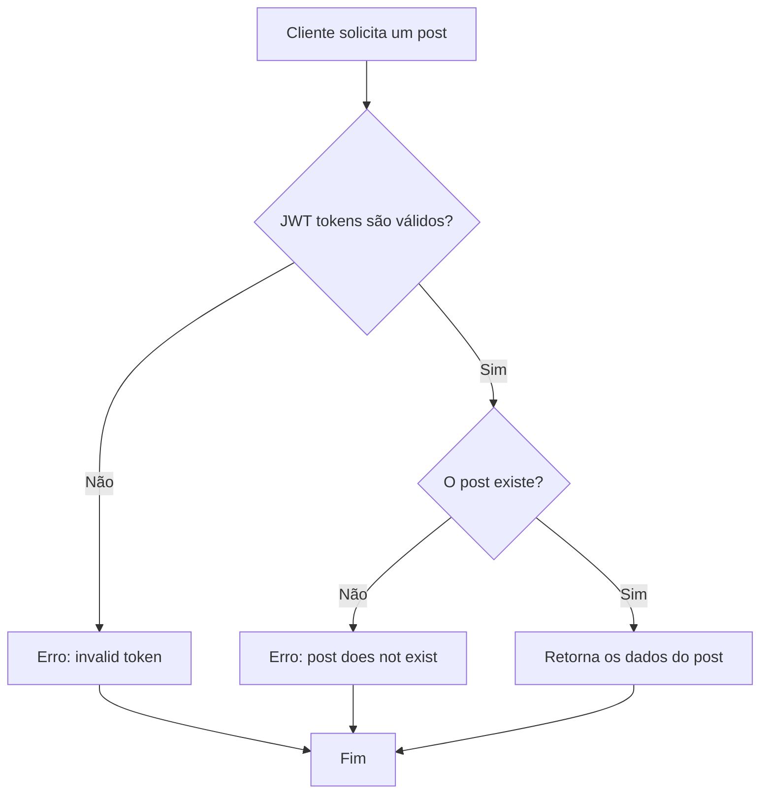
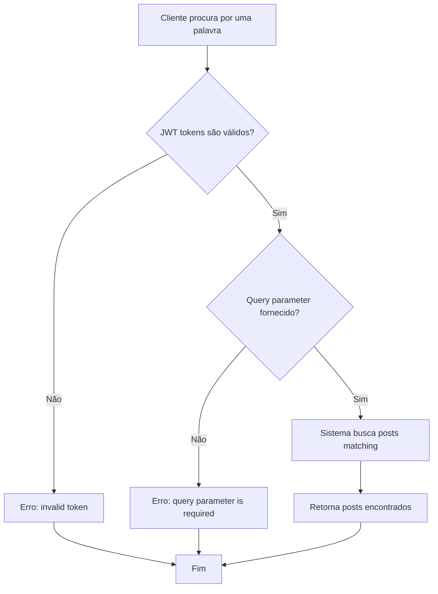
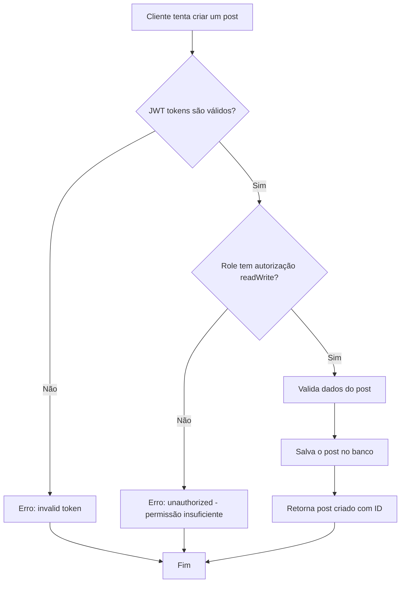
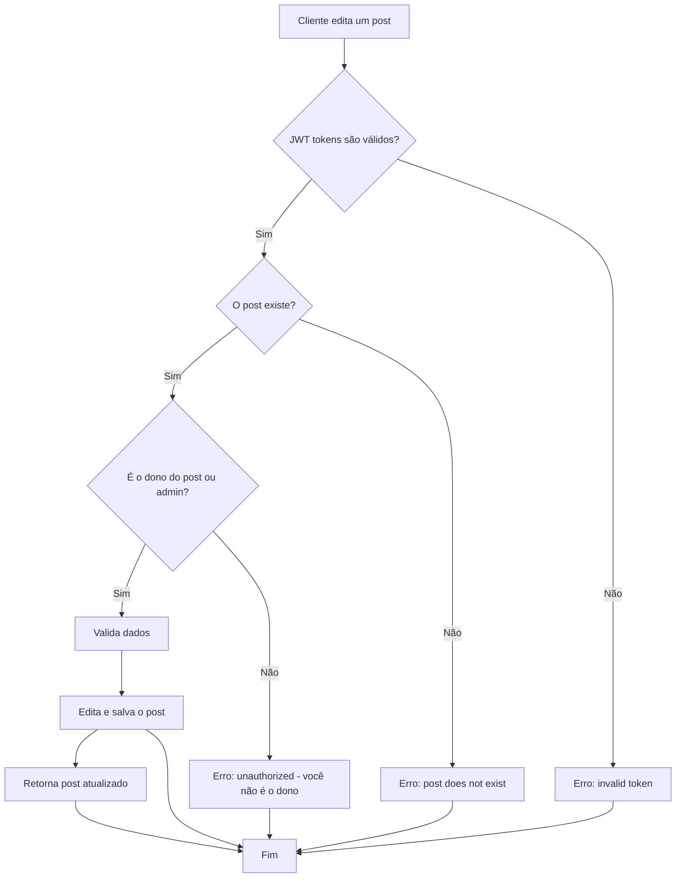
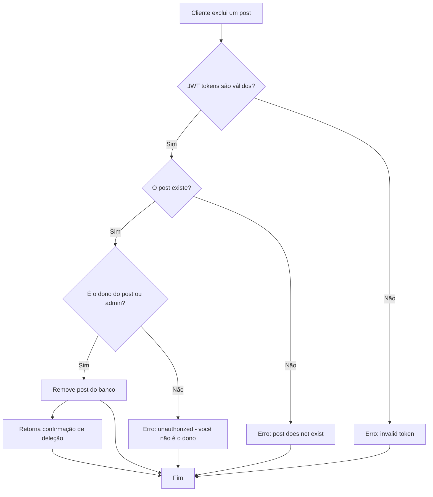

 # Back-end sistemas de Posts


# Índice 
* [Descrição do Projeto](#descrição-do-projeto)
* [Arquitetura](#arquitetura)
* [Stack Tecnológico](#stack-tecnológico)
* [Estrutura de Camadas](#estrutura-de-camadas)
* [Status do Projeto](#status_do_projeto)
* [Pré-requisitos](#pré-requisitos-para-executar-o-projeto)
* [Definir Env](#definir-env)
* [Subir a Aplicação](#subir-a-aplicação)
* [Funcionalidades](#funcionalidades)
* [Gerenciamento Básico de Usuários](#gerenciamento-básico-de-usuários)
* [Gerenciamento de Posts](#gerenciamento-de-posts)
* [Desafios Enfrentados](#desafios-enfrentados)
* [Mudanças Necessárias e Melhorias](#mudanças-necessárias-e-melhorias)
* [Considerações Finais](#considerações-finais)

# Descrição do projeto

Este é um Back end completo para um sistema de gerenciamento de posts proposto como resolução do Tech Challenge 2 da FIAP,
esse back-end será usado para dar  vida a versão escalável do sistema feito no Tech Challenge 1 onde foi usado o OutSystems
para fazer o sistema original. Este projeto possui os arquivos necessários para subir uma API e um banco de dados.

## Arquitetura

A API do projeto foi programada usando Node.js e o Express para roteamento, para banco foi utilizado o mongoDB devido a facilidade de adaptações do banco de dados, o projeto possui um sistema de autenticação simples, testes foram realizados utilizando o Jest.

A arquitetura segue o padrão de camadas (layers) onde cada responsabilidade fica bem definida e separada:

```
API Layer (Express Routes)
        ↓
Controller Layer (Lógica de requisições)
        ↓
Service Layer (Regras de negócio)
        ↓
Model Layer (Mongoose Schemas)
        ↓
Database (MongoDB)
```

Dessa forma fica muito mais fácil manter o código, testar e escalar quando necessário.

### Stack Tecnológico

**Dependências Principais:**
- Express 5.2.1 - Framework para roteamento e requisições HTTP
- Mongoose 9.1.1 - ODM (Object Data Modeling) para MongoDB
- JWT 9.0.3 - Autenticação com tokens
- bcrypt 6.0.0 - Encriptação de senhas
- CORS 2.8.6 - Controle de requisições entre domínios
- Jest 30.2.0 - Framework de testes automatizados

**Infraestrutura:**
- Docker e Docker Compose - Containerização da aplicação
- MongoDB - Banco de dados NoSQL
- Node.js V22 - Runtime JavaScript

### Estrutura de Camadas

**Controllers** (`controllers/`)
- `userControllers.js` - Lógica de registro, login e logout
- `postcontrollers.js` - CRUD (Create, Read, Update, Delete) de posts

**Models** (`models/`)
- `model.js` - Definição dos schemas User e Post

**Services** (`services/`)
- `passwordService.js` - Funções de geração e validação de senhas
- `seed.js` - Criação de usuário admin padrão

**Middlewares** (`middlewares/`)
- `middlewares.js` - Autenticação JWT, validação de roles e CORS

**Routes** (`routes/`)
- `routes.js` - Definição de todos os endpoints da API


## Status do Projeto

Este projeto já cumpre com os requisitos proposto pelo Tech Challenge tornando-o assim completo para a entrega

## Pré-requisitos para executar o projeto

* Node.js(V22)
* Docker desktop
* Docker Compose

### Definir env

* Primeiro passo é definir a porta onde a API irrá escutar as requisições
```
PORT = 3000
```

* Agora prepare o link de conexão com o mongoDB
```
MONGO_URI = mongodb://mongo:27017/postDB
```

* Defina as variáveis secrets
```
ACCESS_TOKEN_SECRET=...
REFRESH_TOKEN_SECRET=...
```

* Defina o email para Administrador e senha
```
ADMIN_PASSWORD = "Senha para administrador" 
ADMIN_EMAIL = "Email para administrador"
```

### Subir a aplicação

* Para subir a aplicação será necesspario ter o docker na sua máquina
* Após a instalação do docker e iniciar os processos do mesmo digite o comando abaixo no mesmo local do projeto

```
docker-compose up --build
```



## Funcionalidades

Este sistema implementa as seguintes funcionalidades principais com endpoints RESTful bem definidos. Para uma documentação detalhada sobre todos os endpoints, fluxos de dados e integração com o frontend, consulte o arquivo `ARQUITETURA_E_DESENVOLVIMENTO.md`.

### Endpoints Principais

Os endpoints da API foram organizados em duas categorias principais:

**Autenticação e Usuários:**
- `POST /users/register` - Registrar novo usuário
- `POST /users/login` - Autenticar usuário
- `GET /users/logout` - Fazer logout
- `GET /users` - Listar todos os usuários (admin)
- `PUT /users/:id` - Atualizar dados do usuário (admin)
- `DELETE /users/:id` - Deletar usuário (admin)

**Gerenciamento de Posts:**
- `GET /posts` - Listar todos os posts (com paginação)
- `GET /posts/:id` - Obter detalhes de um post específico
- `GET /posts/search?q=termo` - Buscar posts por palavra-chave
- `POST /posts` - Criar novo post (requer autenticação)
- `PUT /posts/:id` - Editar post existente (apenas dono ou admin)
- `DELETE /posts/:id` - Deletar post (apenas dono ou admin)

### Gerenciamento Básico de Usuários

Para deixar os testes da aplicação mais simples e avaliação foi criado rotas de gerenciamento básicos de usuários
sendo eles o registro de usuários, login e autenticação de usuários e o logout de usuários.
Essa funcionalidade não foi pedida no Tech Challenge porém foi decidido que seria interessante ter a mesma para testes de bloqueio de autorização da aplicação,
mais no futuro o certo seria criar uma outra aplicação mais completa e robusta apenas para o gerenciamento de usuários para separar as regras do negócio.

- `POST /users/register`: Endpoint para registrar um usuário
  
```
{
    "user_name": "nome do usuário",
    "user_email": "email do usuário",
    "user_pass": "senha do usuário",
    "role": "role do usuário podendo ser read ou readWrite"
}
```

**Fluxo:** O cliente submete as credenciais → O sistema valida os dados → Usuário é salvo no banco de dados com senha encriptada via bcrypt



- `POST /users/login`: Endpoint para logar com as credenciais de um usuário
  
```
{
    "user_email": "email do usuário",
    "user_pass": "senha do usuário"
}
```

**Fluxo:** O cliente submete email/senha → Sistema verifica credenciais → Se válidas, gera JWT tokens → Retorna token e dados do usuário



- `GET /users/logout`: Endpoint para logout de um usuário

**Fluxo:** O cliente solicita logout → Sistema invalida token da sessão → Cliente remove token do armazenamento local



**Endpoints Administrativos de Usuários:**

- `GET /users`: Listar todos os usuários (requer role admin)
- `PUT /users/:id`: Atualizar informações de usuário (admin)
- `DELETE /users/:id`: Deletar usuário (admin)

### Gerenciamento de Posts

Esse é o ponto principal da aplicação, a aplicação possui controles para criar, visualizar um ou mais posts, procurar por posts que possuem certas palavras, editar posts e deletar posts.
As rotas de criação, edição e exclusão de posts são protegidas por autenticação onde apenas usuários logados com permissão `readWrite` podem criar, editar e excluir posts.
A rota de editar também é protegida para evitar que outras pessoas sem ser o criador do post o edite (exceto admin).
As rotas de visualização e procura de posts são protegidas de forma que apenas usuários logados possuem autorização para acessar.

- `GET /posts`: Endpoint para retornar todos os posts com suporte a paginação

```
Query Parameters (opcionais):
?page=1&limit=10
```

**Fluxo:** Cliente solicita lista de posts → Sistema valida JWT → Retorna posts com dados do criador e metadados



- `GET /posts/:id`: Endpoint para retornar detalhes completos de um post específico

```
Retorna:
{
    _id: ObjectId,
    user_name: String,
    user_id: String,
    post_title: String,
    post_description: String,
    post_creation_date: Date,
    post_last_modify_date: Date,
    post_video_url: String
}
```

**Fluxo:** Cliente solicita post específico → Sistema valida JWT e existência do post → Retorna dados completo do post



- `GET /posts/search?q=termo`: Endpoint para procurar por posts que contenham uma palavra-chave

```
Query Parameters (obrigatório):
?q=palavra-chave (busca em titulo e descrição)
```

**Fluxo:** Cliente submete termo de busca → Sistema valida JWT e parametro → Filtra posts matching → Retorna resultados



- `POST /posts`: Endpoint para criar novo post
```
{
    "post_title": "título do post",
    "post_description": "descrição do post",
    "post_video_url": "link para um vídeo YouTube"
}
```

**Fluxo:** Cliente submete dados do post → Sistema valida JWT e permissão → Cria post → Retorna post criado com ID



- `PUT /posts/:id`: Endpoint para editar post existente
```
{
    "post_title": "novo título",
    "post_description": "nova descrição",
    "post_video_url": "novo link de vídeo"
}
```

**Fluxo:** Cliente submete edição → Sistema valida JWT, existência e propriedade do post → Atualiza → Retorna post editado



- `DELETE /posts/:id`: Endpoint para exclusão de posts

**Fluxo:** Cliente solicita deleção → Sistema valida JWT, existência e propriedade → Deleta do banco → Confirma deleção



---

**Para uma análise técnica detalhada sobre como esses endpoints são consumidos pelo frontend, fluxos de dados e integração com React Native, consulte a seção "Fluxo de Funcionamento" no arquivo `ARQUITETURA_E_DESENVOLVIMENTO.md`.**


## Desafios Enfrentados

A maior dificuldade durante a criação do app foi a montagem dos controles da API, não foi uma dificuldade impeditiva, porém foi necessário muitas horas gastas em leitura de documentação, debug, e aulas complementares para entender a estruturação, melhores práticas de código e encriptamento de dados. Um ponto de falha como programador foi que durante todo o tempo de pesquisa e implementação houve vezes em que foi perdido o objetivo do programa ou variáveis eram passadas de forma errada por não ter separado um desenho das variáveis dentro banco de dados.

Houve dificuldades também durante a montagem do container utilizando o docker-compose, visto que pequenos detalhes de comandos poderiam resultar em erros como a falta do "." em um dos comandos, oque gerou horas desnecessárias de debug em códigos que já estavam corretos.

Outro problema foram os testes, como eu tenho pouco tempo para realizar as aulas e fazer o projeto decidi optar por fazer o projeto enquanto via as aulas, assim as aulas de TDD ficaram mais para o meio/final do projeto, isso dificultou a ideia do código ser criado juntamente dos testes, também foi necessário muito estudo nessa parte visto que o Jest de apresentou como uma ferramenta nova na minha caixa de ferramentas, isso demandou mais leitura de documentações e video aulas. Muitas vezes também a função funcionaria em situações reais mas não passaria no teste por falta de conhecimento minha de como realizar o mesmo.

Dificuldade *pessoal* de interpretação, como eu venho de outra área onde tudo deve ser detalhado nos mínimos detalhes, ter a falta de instruções muito específicas deixaram-me confuso, isto aconteceu nas rotas GET /posts onde a rota é citada duas vezes durante o TechChalenge. Assim não sei se o endpoint possui duas funções ou uma, visto que para o sistema desenvolvido todo post criado é um post publicado já que não foi reqwuisitado que deveriam ter posts que não seriam publicados mas que seriam criados.

### Desafios Técnicos Identificados

Durante o desenvolvimento e revisão arquitetural, alguns desafios técnicos foram identificados e precisam de atenção:

**1. Replicação de Dados**
O modelo atual armazena `user_name` nos posts, criando inconsistência: quando um usuário muda de nome, os posts antigos mantêm o nome antigo. Isso gera complexidade desnecessária e possíveis bugs.

**2. Falta de Relacionamento Real no Banco**
O banco não utiliza referências (foreign keys) entre User e Post, apenas cópias de dados. Isso causa:
- Dificuldade em fazer queries eficientes
- Impossibilidade de usar `.populate()` do Mongoose
- Falta de integridade referencial

**3. Validação Inconsistente**
Cada controller faz suas próprias validações sem padronização, deixando brecha para erros e falta de consistência nas mensagens de erro.

**4. Falta de Estrutura Padrão em Respostas**
Diferentes endpoints retornam formatos diferentes, dificultando o consumo da API pelo frontend.

**5. Tokens sem Expiração**
Os JWT tokens não possuem tempo de expiração adequado, criando vulnerabilidades de segurança. Não há implementação de refresh tokens.

**6. Paginação Não Otimizada**
A paginação não é implementada no backend, deixando a cargo do frontend carregar todos os posts. Isso afeta performance com muitos registros.

## Mudanças Necessárias e Melhorias

Para que o sistema se torne mais robusto, seguro e escalável, as seguintes mudanças são recomendadas:

### Priority 1 - Crítico

**1. Refatorar Relacionamentos no Banco**
```javascript
// Modelo ATUAL (problemático)
Post: { user_name, user_id, post_title, ... }

// Modelo RECOMENDADO
Post: {
  userId: ObjectId,  // Referência real para User
  post_title: String,
  post_description: String,
  post_video_url: String,
  ...
}
```

**2. Implementar Validação Centralizada**
Usar `express-validator` para padronizar validações em um middleware reutilizável em todos os endpoints.

**3. Padrão Único de Resposta**
```javascript
// Padrão RECOMENDADO
{
  success: boolean,
  data: T,
  message: string,
  errors?: [{ field: string, message: string }]
}
```

**4. JWT com Expiração e Refresh Tokens**
```javascript
// Access token: 1 hora de duração
// Refresh token: 7 dias de duração
// Implementar endpoint para renovação de tokens
```

### Priority 2 - Importante

**5. Rate Limiting**
Proteger endpoints contra requisições em massa com `express-rate-limit`.

**6. Logging Estruturado**
Implementar sistema de logs com Winston ou Morgan para rastrear atividades e facilitar debug em produção.

**7. Error Handler Centralizado**
Criar middleware único para tratamento de erros em toda aplicação, evitando try-catch repetidos e inconsistentes.

**8. Paginação no Backend**
Implementar skip/limit nos endpoints de listagem:
```
GET /posts?page=1&limit=10
```

### Priority 3 - Nice to have

**9. Versionamento de API**
Prefixar endpoints com versão (`/api/v1/posts`) para permitir mudanças futuras sem quebrar clientes.

**10. Documentação Swagger/OpenAPI**
Adicionar auto-documentação dos endpoints para facilitar consumo da API.

**11. Aumentar Cobertura de Testes**
Expandir testes unitários e de integração para > 80% de cobertura.

## Considerações Finais

Uma dificuldade que se tornou uma conquista foi fazer tudo isso sozinho e viajando por pelo menos 2 semanas por mês a trabalho durante mais da metade da etapa do curso, durante as viagens devido ao ambiente de trabalho ser muito desgastante mentalmente não conseguia programar. Houve momentos que eu me perguntei se realmente iria conseguir, se isso não era uma perca de tempo e dinheiro, que se não seria mais fácil fazer isso tudo com a ajuda de IA e estudar depois. Porém eu sei que não vou estudar depois e se eu fizesse tudo com IA e não iria aprender nada, então comecei a fazer sacrifícios, acordava 4 horas da manhã todo dia para ver as video aulas do curso e saia para trabalhar as 7 horas chegando muitas vezes em casa as 18 horas, programava este projeto enquanto via as aulas, gastava meus sabados e domingos para maratonar o curso, dormia tarde no sabado e acordava cedo nos domingos, sacrifiquei até meu natal e ano novo kkkkkkk. Infelizmente não consegui ver todas as video aulas, devido as circunstancias assim tive que limiar a escolha do banco de dados e acabei optando pelo mongo pela facilidade adaptação do banco durante o decorrer do projeto, assim sacrifiquei as aulas do PostgreSQL e algumas outras para fazer aquelas que estavam diretamente ligadas a arquitetura escolhida, aprendi muitas coisas com isso, e completar este projeto fazendo pesquisas em documentação, pouca intervenção de IA(sendo usada para quando não achava a resolução online de problemas) me deu mais forças para continuar e não desitir da pós-graduação.

### Sobre este Documento

Este README fornece uma visão geral da arquitetura e funcionamento do backend. Para uma análise técnica mais profunda sobre a arquitetura do sistema completo (frontend + backend), desafios específicos e recomendações detalhadas, consulte o arquivo `ARQUITETURA_E_DESENVOLVIMENTO.md` na raiz do projeto.

**Documentação Complementar:**
- **ARQUITETURA_E_DESENVOLVIMENTO.md**: Análise completa da arquitetura, fluxos de dados, desafios e lições aprendidas
- **Controllers**: Lógica de negócio em `controllers/`
- **Models**: Estrutura de dados em `models/model.js`
- **Routes**: Definição de endpoints em `routes/routes.js`
- **Tests**: Testes automatizados em `jestTests/`

**Status Geral do Projeto:**
- ✅ Funcionalidades principais implementadas e testadas
- ✅ Autenticação e autorização funcionando
- ✅ CRUD de posts operacional
- ✅ Endpoints documentados com fluxogramas
- ✅ Docker containerizado e pronto para produção
- ⚠️ Melhorias técnicas identificadas para evolução futura

# Autor do projeto - Gabriel Henrique Gonçalves - 2026


